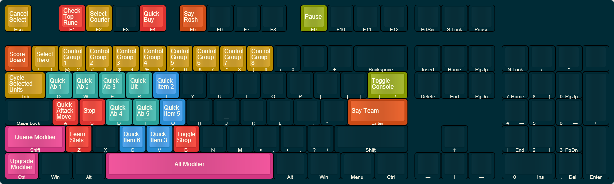

Skipped's Reborn Dota 2 Config
=======================

This is my configuration for Dota 2. The overall goal is to provide as much reachable functionality as possible.

Quick How-To:
----------
You can download the repository on the left under **Downloads**

####Place the *cfg* files in:
`$steam$/steamapps/common/dota 2 beta/game/dota/cfg`
(where $steam$ is your Steam installation folder)

[The thorough installation guide](installation.md)

Keybind Guide
-----
The images below give an overview of the hotkeys.

####Default Keybinds
 To edit, upload `layouts/normal.json` [here](https://keyboard-layout-editor.com)

####Spacebar Pressed

## Launch Options (optional)
--------------
`-novid -high -windowed -noborder -w 1920 -h 1080 -enable_addons-map dota -antiaddiction_test`

####Copy the launch options to:
1. Right click on Dota 2 in Steam Library
2. Select "Properties"
3. Select "Set Launch Options"
4. Paste into the box, then add your monitors dimensions where it says to put them (you'll know, it's at the end)
